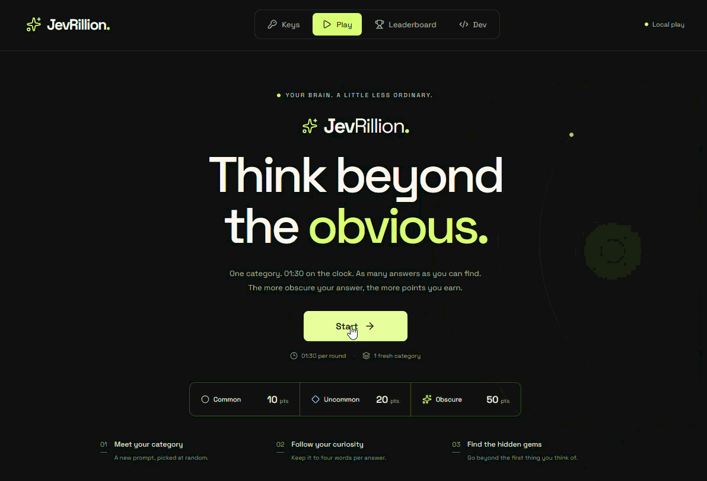

# JevRillion



JevRillion is a category word game inspired by [Krillion](https://krillion.io/). Players are given a category (e.g. "Name a fruit") and race to enter as many valid answers as possible before the timer runs out. Common answers earn points, while uncommon and obscure answers earn progressively more.

## Why Jev?

JevRillion was built to explore game logic made practical by **Jev, a System One decision model designed for extremely fast classification**. Instead of generating text token-by-token like a traditional LLM, Jev evaluates inputs against defined criteria and returns structured decisions in under half a second. **It can run up to 200× faster at a fraction of the cost**, making it practical to judge every answer a player submits in real time, Something a conventional LLM could theoretically do, but not fast or cheaply enough for responsive gameplay.

Because Jev brings broad language understanding without requiring a fixed answer bank, **the game can score valid answers the developer never anticipated**. Categories are defined in human-editable JSON using Jev's structured [Choice output](https://docs.typesafe.ai/primitives/choice), where developers specify what should count as Common, Uncommon, Obscure, or invalid, and Jev handles the classification at runtime.

## How are questions defined?

Each game category is defined as a small JSON object containing the question shown to the player, a set of instructions for Jev, and the labels Jev can return.

For example, the production version of **"Name fruit"** includes detailed guidance around botanical vs. culinary definitions, spelling, regional familiarity, and rarity. At a high level, though, the query is as simple as:

```json
{
  "displayed_question": "Name fruit",
  "instructions": "Classify the player's answer as common, uncommon, obscure, or not.",
  "criteria": {
    "common": "An obvious everyday fruit most players would name quickly.",
    "uncommon": "A valid but less-obvious fruit.",
    "obscure": "A valid deep-cut fruit many casual players may not know.",
    "not": "Not reasonably considered a fruit."
  }
}
```

Jev's structured **Choice** output then maps each submitted answer directly to one of those labels. This means adding a new category mostly comes down to **describing the category and defining what each scoring tier means**, rather than building or maintaining a list of valid answers.

## How to install and run

JevRillion is currently only playable when hosted locally. To run JevRillion... 
- Install [Node.js 22.12 or newer](https://nodejs.org/en/download). npm is included with Node.js, so you do not need to install it separately. You will also need [Git](https://git-scm.com/downloads) if you want to clone the repository from the command line, and a modern browser.

- Open a terminal in the folder where you want the project, then clone the repository and move into it.

    ```sh
    git clone MattTPin/jevrillion
    cd jevrillion
    ```

- Install the project dependencies, then start the local development server:

    ```sh
    npm install
    npm run dev
    ```

- Open **http://127.0.0.1:5173** in your browser and the game will be live. Keep the terminal running while you play; press **Ctrl+C** there to stop the server.

To use Jev during gameplay, you will also need an [OpenRouter account](https://openrouter.ai/). After launching the game, choose **Connect OpenRouter** and authorize JevRillion; requests are billed to your OpenRouter account.

`npm run dev` starts Vite and a small local Express backend. The backend handles Jev requests, spelling checks, and reading/writing the question and leaderboard JSON files. Vite proxies `/api` requests to it at `127.0.0.1:3001` by default.

## Seamlessly connect your own OpenRouter Account to perform Jev Queries

After launching the game, click **Connect OpenRouter**, this will take you to OpenRouter where you can authorize JevRillion to make Jev requests which will be billed to your account.

- This process uses OAuth with [OpenRouter's OAuth PKCE flow](https://openrouter.ai/docs/guides/overview/auth/oauth) to connect your account without exposing an app secret. You can set usage caps and expiration times for the secret in the UI. Your credential stays in browser memory and is sent to the local game server only to make Jev requests; it is never saved and cleared whenever you refresh or close the page.

The Connect screen loads available TypeSafe Jev models from [OpenRouter's model catalog](https://openrouter.ai/docs/api/api-reference/models/list-all-models-and-their-properties). The model you choose is kept for the active app session and used for connection checks and gameplay.

## Key features

- **Automatic spelling correction**: Whenever a mispelled word is submitted a local spell check can try the closest valid correction alongside the player's original answer, allowing for answers points to still be scored. Traditional NLP still has it's place!
- **Configuration and easy model upgrades**: change the default Jev model, probability threshold, round duration, accepted answer threshold, and point values without changing game code by updating `settings.json`.
- **30 Categories of Questions Built in** 
- **Leaderboards**  completed rounds and category scores are stored locally for quick comparison.

## Development with agents

[AGENTS.md](AGENTS.md) provides project context, a directory guide, and development conventions for coding agents. [Focused skills](.agents/skills/) cover question writing, scoring, OpenRouter integration, and testing to help agents make changes and additions consistently.

## Configuration

Edit the root `settings.json` to change game settings. It contains no API keys; OpenRouter credentials come from the Connect screen. Restart the app and refresh the page after changing settings.

| Setting                          | Default / purpose                                                           |
| -------------------------------- | --------------------------------------------------------------------------- |
| `VITE_DEFAULT_JEV_MODEL`         | `typesafe/jev-1.13`; pinned default selected on the Connect screen          |
| `CONFIDENCE_THRESHOLD`           | `90`; combined Common, Uncommon, and Obscure probability must exceed this percentage |
| `BONUS_STEP_UP_MARGIN`            | `7` percentage points; makes answers more likely to trigger uncommon or obscure bonus points (`0` disables) |
| `DUPLICATE_SIMILARITY_THRESHOLD` | `95`; similarity percentage for repeat detection                            |
| `REGION`                         | `western`; selects an instruction from `src/questions/region_prompts.json`     |
| `ROUND_SECONDS`                  | `90`; displayed as 01:30                                                    |
| `COMMON_POINTS`                  | `10`                                                                        |
| `UNCOMMON_POINTS`                | `20`                                                                        |
| `OBSCURE_POINTS`                 | `40`                                                                        |
| `DEV_MODE`                       | `false`; `true` shows the question workshop                                 |
| `BACKEND_PORT`                   | `3001`; local API port, also used by Vite's proxy                            |

## Test and build

```sh
npm run lint
npm run typecheck
npm test
npm run test:e2e
npm run build
```

The automated browser tests simulate the OpenRouter redirect and credential exchange without logging into any account. A real OpenRouter login and live Jev call require manual testing with your own account. `npm run build && npm start` serves the built app and API from the local server on port 3001.